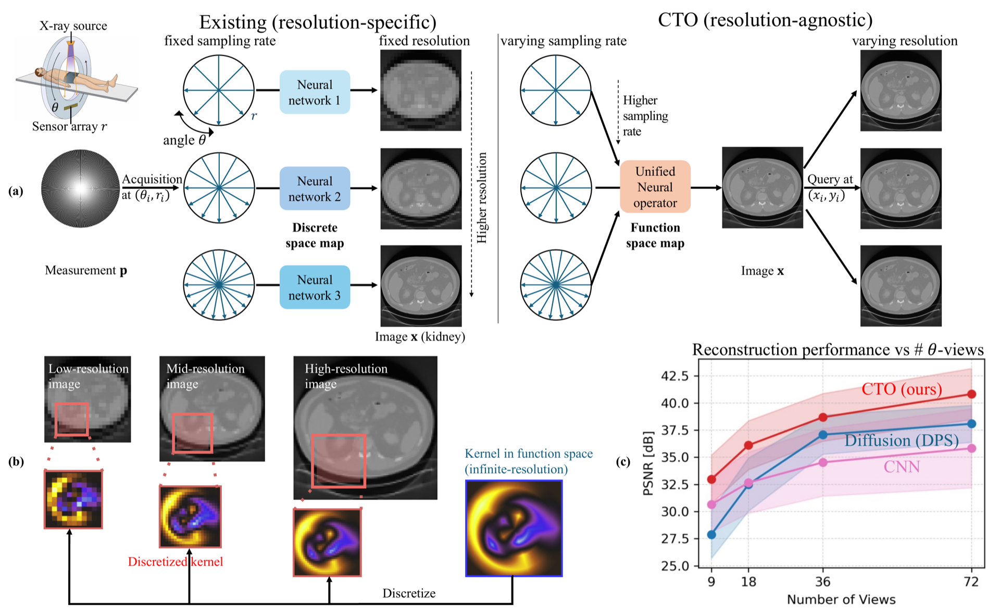
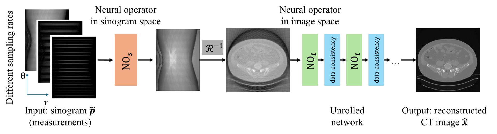

# Resolution-Agnostic Neural Operators for Multi-Rate Sparse-View CT<br><sub>ECCV 2026</sub>



**Resolution-Agnostic Neural Operators for Multi-Rate Sparse-View CT**<br>
ECCV 2026<br>
Aujasvit Datta, Jiayun Wang, Asad Aali, Anima Anandkumar
<br>arXiv: https://arxiv.org/abs/2512.12236<br>

Abstract: *Sparse-view Computed Tomography (CT) reconstructs images from a limited number of X-ray projections to reduce radiation and scanning time, which is an ill-posed inverse problem. Existing methods achieve high-fidelity reconstructions but overfit to a fixed acquisition setup, failing to generalize well across sampling rates. For example, convolutional neural networks (CNNs) use the same kernels across resolutions, leading to artifacts when data resolution changes. This is a critical limitation in clinical practice, where acquisition sampling settings vary across organs and diagnostic protocols. We propose Computed Tomography neural Operator (CTO), the first neural operator (NO) framework for CT reconstruction. CTO extends learning from fixed discretized grids to continuous function space, enabling a single model to generalize across measurement sampling rates without retraining. We also propose new NO architectural designs for CT: (i) a dual-domain NO architecture in both sinogram and image spaces, capturing complementary spatial-frequency information, and (ii) rotation-equivariant DIScrete-COntinuous convolutions (DISCO) that exploit the rotational structure inherent in tomographic acquisition. Empirically, CTO outperform CNNs (>3.4dB PSNR gain) and other baselines in multi-resolution settings across multiple CT datasets. Compared to state-of-the-art diffusion methods, CTO has 500× faster inference with an average 3dB gain. CTO further demonstrates strong out-of-distribution robustness, maintaining gains under cross-dataset transfer and noisy sinogram conditions. Ablation studies also validate each design choice. CTO establishes neural operators as a principled and practical paradigm for flexible, discretization-agnostic CT reconstruction. Our code is available at https://github.com/neuraloperator/sparse_ct.*



All common tasks are wrapped as `make` targets. Run `make help` to list them. Every target is a thin wrapper around a `python ...` command if you prefer to run things directly.

## 1. Configuration

Before running anything, review `configs/base.yaml` and update it for your setup. Common changes:
- `use_wandb`: set to `false` to disable Weights & Biases logging for both train and test.
- `logger.project` and `logger.entity`: your Weights & Biases project and account. Leave `entity` as `null` to use your logged-in default, or set `WANDB_ENTITY`.
- `trainer.num_devices`: the number of GPUs to use.
- `trainer.max_epochs` and `trainer.lr`: training hyperparameters.

Dataset-specific settings (model, sampler, batch size, data paths) live in `configs/aapm.yaml` and `configs/kits.yaml`.

## 2. Install

```
conda create --name cto_env python=3.11
conda activate cto_env
make setup          # install python dependencies
make torch-radon    # build torch-radon (needs a CUDA build environment: nvcc + toolkit)
```
Tested with Python 3.11 on Linux. `make torch-radon` clones torch-radon, applies the required patch from `torch-radon_fix/`, and builds it.

## 3. Data

The Low-dose CT **AAPM** dataset is substantially smaller than the **C4KC-KiTS** dataset, hence easier to work with. Download the raw data first, then preprocess it:

- **AAPM**: download from https://aapm.app.box.com/s/eaw4jddb53keg1bptavvvd1sf4x3pe9h/folder/144226105715, then unzip `FD_1mm.zip` to `full_1mm/`.
- **C4KC-KiTS**: download from https://www.cancerimagingarchive.net/collection/c4kc-kits/.

To preprocess the data, run:
```
make data-aapm AAPM_RAW_DIR=/path/to/full_1mm
make data-kits KITS_RAW_DIR=/path/to/C4KC-KiTS
```
Preprocessed data is written to `data/aapm/` and `data/kits/` (matching the configs).

## 4. Test the pretrained models

Download our pretrained weights and test them (needs the corresponding preprocessed dataset from step 2):

```
make weights        # download pretrained weights from Hugging Face -> ./weights
make test-aapm      # test the AAPM model
make test-kits      # test the C4KC-KiTS model
```
Metrics are printed and saved to `results/` as CSV + JSON. No Weights & Biases account is required.

## 5. Train

```
make train-aapm
make train-kits
```
Trained models are saved under `models/`. Training logs to Weights & Biases by default; set `WANDB_ENTITY=<your-username>` to choose the entity, or set `use_wandb: false` in `configs/base.yaml` to turn logging off.

## Notes

- `make help` lists every target.
- Set the number of GPUs (`num_devices`) in `configs/base.yaml`.
- Testing loads a checkpoint from a folder via `--fix init_exp_dir <dir>` (this is what the `test-*` targets do with `weights/`); to test your own trained model instead, drop that flag so it reads from the config's `exp_dir` under `models/`.
